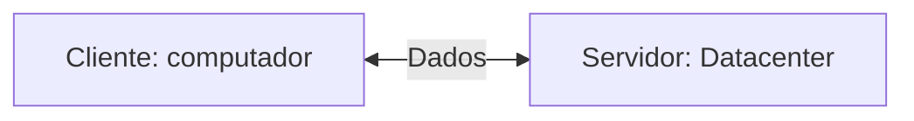
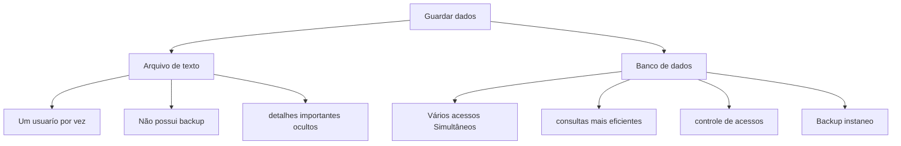
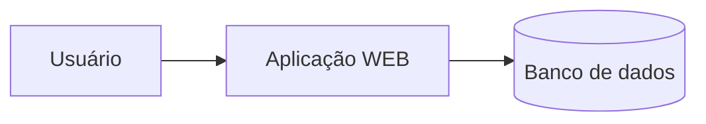

### Servidor de Desenvolvimento
será uma interface de desenvolvimento, utilizando para projetar aplicações e banco de dados. 


---
## Servidor de Arquivos Educacional 
É um servidor para armazenar arquivos e facilitar na hora de realizar tranferencia

> O endereço para o servidor de arquivos é: `\\10.87.36.10`.

>`Credenciais de acesso: E-mail: aluno, Senha: aluno` 

---
O Moba será a interface para acesso ao meu servidor de desenvolvimento.
>O acesso, será realizado via SHH
>credencias: `IP:192.168.10.80`username: `root`, Porta:`2222`

para acessar use a senha: Caio13121113@

---

para alterar senha, utilizar o comado:
```bash
passwd
```
para visualizar os recursos do meu servidor foi utilizado o comado:
```bash
htop
````
---
|Recurso|Configuração|
|----|-------|
|Processador|2 cores|
|RAM|512MB|
|Armazenamento|6 GB|
|Sistema Operacional|Ubuntu 26.04-LTS|
---


A utilização de um servidor de desenvolvimento, simula um ambiente real de produção
Os objetivos esperados são:

- Deploy de projetos,
- Aplicação de banco de dados,
- experiência real de mercado

## Banco de dados 
antigamente, os dados eram salvos em arquivos/planilhas 


---
mas afinal, onde entra em banco de dados em aplicações WEB??


### SGBD 

Sistema Gerenciador de Banco de Dados.

>Função: Gerenciar, controle e permitir consultas nos nossos bancos  de dados.

````mermaid
graph TD
A[SGBD - postgreSQL] -->B[(Banco de dados)]
A --> C[Armazena usuários]
A --> D[realizar consulta]
A --> E[controle de acesso]
````

comando para baixar o postgreSQ
```
apt install -y postgresql

