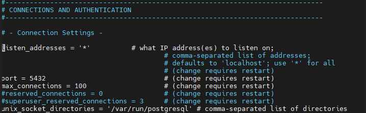
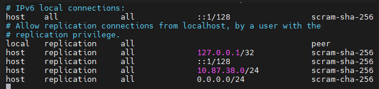

## configurando o SGBD
SGBD: Sistema Gerenciandor de Banco de Dados para instalação, utilizamos o comando:

``` bash
sudo apt install -y postgresql
```

>No meu servidor, como eu já estava como root, não foi necessário o sudo

para acesso inicial, utilizamos o comando:

```bash
sudo -u postgres psql
```

>Autenticação via Linux, não necessita de senha, pois você já está autenticado.

após primeiro acesso, alteramos a senha, através do comando:
```sql
ALTER USER postgres PASSWORD '--------';
```

Para sair do SGBD, utilizamos o comando: `\q`.
>Comando famoso \quit em games.

Para acesso externo, utilizamos o comando:
```bash
sudo psql -h 127.0.0.1 -U postgres
```
>aqui, ele vai necessitar de senha!

---
Alterações até o caminho:
```bash
cd /etc/postgresql/18/main
```

2.Editamos o arquivo postgresql.config através do coamndo:
```bash
sudo nano postgresql.config
```
linha listen_adresses = '*'
>Para pesquisar a linha: `CTRL+W`



3.Segunda alteração no arquivo pg_hba.config:
```bash
sudo nano pg_hba.conf
```
4.Alterações realizadas:



1. Usamos o 0.0.0.0/24 para que podemos acessar nosso servidor em qualquer lugar em todas as faixas de IP(que seria o /24)
2. igualmente quando digitamos o 10.87.38.0/24 para que podemos acessar o servidor quando estevemos na outra sala.

>Servidor de Desenvolvimento 

1. comando SQL:

```bash
CRATE DATABASE ----?
```
\L seria a lista de todos os bancos de dados.

>criado seu DATABASE

1. você ira reiniciar seu servidor para poder inicial ele
```bash
sudo systemctl restart postgresql
```

2. depois ira ver como o servidor está olhando seus status do seu servidor para poder usar o 'start'
```bash
sudo systemctl status postgresql
```
3.  após isso use o comando abaixo para poder realmente inicair o servidor
```bash
sudo systemctl start postgresql
```

4. ele sobe o servidor
```bash
pg_lsclusters
```


