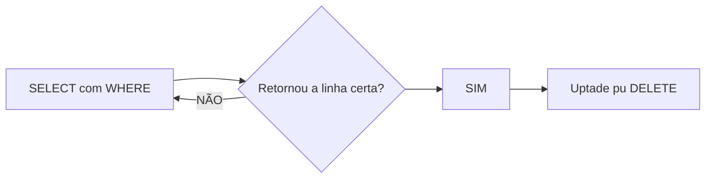

## Update e Delete 
**Uptade** ou **DELETE** afetam todas as linhas da sua tabela. logo, **JAMAIS** executar sem o comando `WHERE`.



## Comandos aprendidos em aula


- SELECT * FROM produtos;


- INSERT INTO produtos(nome,preço,estoque)
 VALUES
 ('torneira',100,50),
 ('Aspirador de pó',150,30),
 ('Lustre',10000,10);

- SELECT * FROM produtos WHERE nome= 'Lustre';

- UPDATE produtos
SET preço=5000
WHERE nome='Lustre';

- DELETE FROM produtos WHERE id IN (4,2,5);

```sql

INSERT INTO  Streaming(nome,duração,avaliação)
VALUES
('Um Sonho de Liberdade','142','9.3'),
('O Poderoso Chefão',' 175','9.2'),
('O Cavaleiro das Trevas','  152','9.0'),
('O Poderoso Chefão: Parte II','202','9.0'),
('12 Homens e uma Sentença',' 96',' 9.0'),
('A Lista de Schindler',' 195 ','9.0'),

```