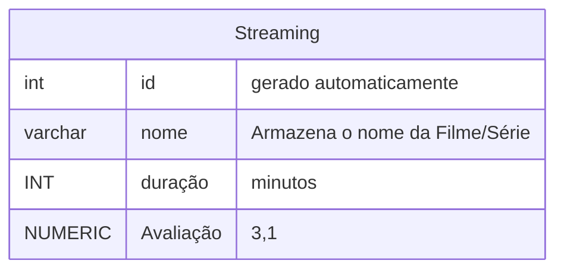
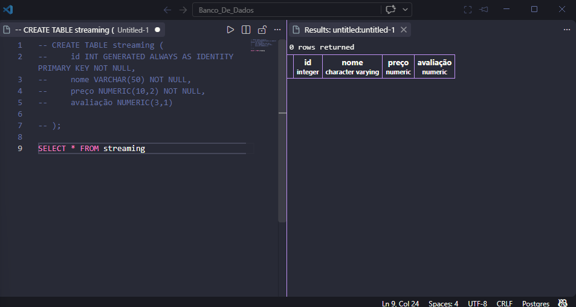

### Atividade aula 05
 Criar um banco de dados de Streaming de Filmes e Séries.
 -  Tabela com as colunas: ID, nome, duração (min), avaliação(0 - 10)
 - Inserir 20 registros (filmes e séries)
 - Exibir os 10 filmes melhores avaliados
 - Atualizem algumas notas
 - Apaguem 5 registros.

```bash
cd /etc/postgresql/18/main
``` 
>Para poder acessar o posgresql e craiar seu database 

para criar um novo banco de dados, utilizamos o comando:
```sql
CREATE DATABASE Streaming;
```
>onde vai aparecer CREATE DATABASE e veja se aparece no sua lista de servidores para confirmar use \l e saia com \q

depois disso ir para para VS para modelação de dados 

**Modelando o banco de dados cidade**



>execute o comando usando F5 e depois comente usando o comando ctrl + ;

>precisa ter 20 registros (filmes e séries),


```sql

CREATE TABLE streaming (
    id INT GENERATED ALWAYS AS IDENTITY PRIMARY KEY NOT NULL,
    nome VARCHAR(50) NOT NULL,
    duração NUMERIC(10,2) NOT NULL,
    avaliação NUMERIC(3,1)
    
);
```
>Criação da tabela
---

para consultar todos os dados tabela:

```sql
SELECT * FROM  Streaming;
```




---

```sql
INSERT INTO  Streaming(nome,duração,avaliação)
VALUES('hoemem - aranha','100 min','9.2');
```
>exemplo

Isso será usado para exibir os 10 melhore filmes/séries avaliados 

```sql
SELECT *
FROM Streaming
ORDER BY avaliacao DESC
LIMIT 10;
```

Para atualização de algumas notas podemos usamos:

```sql
UPDATE Streaming
SET avaliacao = nova_nota
WHERE nome = 'Poderoso chefinho';
```
>atualizar as pelo menos umas 3 notas onde vou colocar minha Opinião

depois para apagarmos outros registros usamos:

```sql
DELETE FROM filmes_series
WHERE nome IN (
    'homem aranha',
    'Matriz',
    'entre outros',
);
```

>finalizado atividade!!!!!

