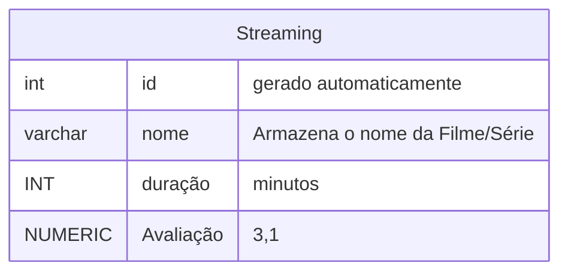
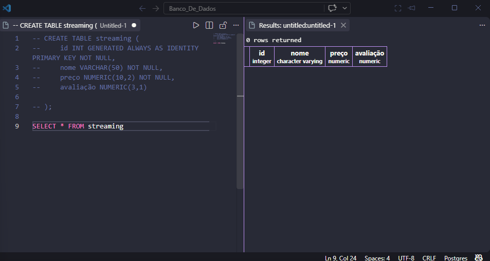

### Atividade aula 05
 Criar um banco de dados de Streaming de Filmes e Séries.
 -  Tabela com as colunas: ID, nome, duração (min), avaliação(0 - 10)
 - Inserir 20 registros (filmes e séries)
 - Exibir os 10 filmes melhores avaliados
 - Atualizem algumas notas
 - Apaguem 5 registros.

```bash
cd /etc/postgresql/18/main
``` 
>Para poder acessar o posgresql e craiar seu database 

para criar um novo banco de dados, utilizamos o comando:
```sql
CREATE DATABASE Streaming;
```
>onde vai aparecer CREATE DATABASE e veja se aparece no sua lista de servidores para confirmar use \l e saia com \q

depois disso ir para para VS para modelação de dados 

**Modelando o banco de dados cidade**


```mermaid 
erDiagram
Streaming{
    int id "gerado automaticamente"
    varchar nome "Armazena o nome da Filme/Série "
    INT duração "minutos"
    NUMERIC Avaliação "3,1"
}
```

>execute o comando usando F5 e depois comente usando o comando ctrl + ;

>precisa ter 20 registros (filmes e séries),


```sql

CREATE TABLE streaming (
    id INT GENERATED ALWAYS AS IDENTITY PRIMARY KEY NOT NULL,
    nome VARCHAR(50) NOT NULL,
    duração NUMERIC(10,2) NOT NULL,
    avaliação NUMERIC(3,1)
    
);
```
>Criação da tabela
---

para consultar todos os dados tabela:

```sql
SELECT * FROM  Streaming;
```




---

```sql
INSERT INTO  Streaming(nome,duração,avaliação)
VALUES('hoemem - aranha','100 min','9.2');
```
>exemplo

Isso será usado para exibir os 10 melhore filmes/séries avaliados 

```sql
SELECT *
FROM Streaming
ORDER BY avaliacao DESC
LIMIT 10;
```

Para atualização de algumas notas podemos usamos:

```sql
UPDATE Streaming
SET avaliacao = nova_nota
WHERE nome = 'Poderoso chefinho';
```
>atualizar as pelo menos umas 3 notas onde vou colocar minha Opinião

depois para apagarmos outros registros usamos:

```sql
DELETE FROM filmes_series
WHERE nome IN (
    'homem aranha',
    'Matriz',
    'entre outros',
);
```

>finalizado atividade!!!!!

código feito na atividade:

```sql

CREATE TABLE streaming (
    id INT GENERATED ALWAYS AS IDENTITY PRIMARY KEY NOT NULL,
    nome VARCHAR(50) NOT NULL,
    duração NUMERIC(10,2) NOT NULL,
    avaliação NUMERIC(3,1)
    
);


SELECT * FROM  Streaming;

INSERT INTO Streaming(nome, duração, avaliação)

VALUES

('Um Sonho de Liberdade', 142, 9.3),
('O Poderoso Chefão', 175, 9.2),
('O Cavaleiro das Trevas', 152, 9.0),
('O Poderoso Chefão: Parte II', 202, 9.0),
('12 Homens e uma Sentença', 96, 9.0),
('A Lista de Schindler', 195, 9.0),
('O Senhor dos Anéis: O Retorno do Rei', 201, 9.0),
('Pulp Fiction', 154, 8.9),
('O Senhor dos Anéis: A Sociedade do Anel', 178, 8.9),
('Três Homens em Conflito', 161, 8.8),
('Interestelar', 169, 8.7),
('Cidade de Deus', 130, 8.6),
('Matrix', 136, 8.7),
('Os Infiltrados', 151, 8.5),
('Vingadores: Ultimato', 181, 8.4),
('Toy Story', 81, 8.3),
('Homem-Aranha: Sem Volta para Casa', 148, 8.2),
('Breaking Bad', 47, 9.5),
('Stranger Things', 50, 8.7),
('The Boys', 60, 8.6);


UPDATE Streaming
SET avaliação = 9.5
WHERE nome = 'Interestelar';

UPDATE Streaming
SET avaliação = 8.8
WHERE nome = 'Matrix';

UPDATE Streaming
SET avaliação = 9.1
WHERE nome = 'Cidade de Deus';

DELETE FROM Streaming
WHERE nome IN (
    'Toy Story',
    'The Boys',
    'Vingadores: Ultimato',
    'Matrix',
    'Stranger Things'
);


```
