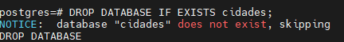

## aula 06

--> análise de dados


```sql
DROP DATABASE Cidades;
```
deleta seu data base
--

```sql
DROP DATABASE IF EXISTS cidades;
```
Você apaga e coloca um parametro "se existe" é intesante notificar para ter uma informção o por que não tem



---

Vamos criar um novo banco de dados

```sql 

CREATE DATABASE kabum;
```

criação da tabela para kabum:

```sql
CREATE TABLE produtos (
    id SERIAL PRIMARY KEY,
    nome VARCHAR(100) NOT NULL,
    categoria VARCHAR(50) NOT NULL,
    preco DECIMAL (10,2) NOT NULL,
    estoque INTEGER NOT NULL
);
```

Inserindo dados dos produtos:

```sql

INSERT INTO produtos (nome, categoria, preco, estoque) VALUES
('Mouse Óptico USB', 'Periféricos', 50.00, 120),
('Mouse Sem Fio', 'Periféricos', 89.90, 85),
('Mouse Gamer RGB', 'Periféricos', 249.00, 32),
('Teclado ABNT2 USB', 'Periféricos', 120.00, 64),
('Teclado Mecânico Gamer', 'Periféricos', 459.00, 18),
('Teclado Sem Fio Slim', 'Periféricos', 199.00, 40),
('Mousepad Grande', 'Periféricos', 45.00, 150),
('Suporte Ergonômico Notebook', 'Periféricos', 135.00, 28),
('Hub USB 4 Portas', 'Periféricos', 79.00, 95),
('Adaptador USB-C HDMI', 'Periféricos', 159.00, 47),

('Monitor 21,5 Full HD', 'Monitores', 750.00, 22),
('Monitor 24 Full HD IPS', 'Monitores', 950.00, 19),
('Monitor 27 QHD', 'Monitores', 1890.00, 8),
('Monitor 32 4K', 'Monitores', 2790.00, 4),
('Monitor Gamer 144Hz', 'Monitores', 1650.00, 11),
('Suporte Articulado Monitor', 'Monitores', 289.00, 26),

('Notebook Básico 8GB', 'Notebooks', 2890.00, 14),
('Notebook Intermediário 16GB', 'Notebooks', 4500.00, 9),
('Notebook Gamer RTX', 'Notebooks', 7990.00, 3),
('Notebook Ultrafino 14', 'Notebooks', 5300.00, 6),
('Chromebook 11', 'Notebooks', 1790.00, 17),
('Carregador Universal 65W', 'Notebooks', 189.00, 58),

('Impressora Laser Mono', 'Impressão', 800.00, 12),
('Impressora Multifuncional', 'Impressão', 1250.00, 7),
('Impressora Tanque de Tinta', 'Impressão', 1090.00, 10),
('Toner Compatível Preto', 'Impressão', 145.00, 72),
('Cartucho Colorido', 'Impressão', 98.00, 88),
('Papel A4 500 folhas', 'Impressão', 29.90, 240),
('Scanner de Mesa', 'Impressão', 690.00, 5),

('Roteador Wi-Fi 5 Dual Band', 'Redes', 249.00, 35),
('Roteador Wi-Fi 6 AX1500', 'Redes', 459.00, 16),
('Switch 8 Portas Gigabit', 'Redes', 329.00, 21),
('Cabo de Rede Cat6 5m', 'Redes', 35.00, 180),
('Repetidor de Sinal Wi-Fi', 'Redes', 139.00, 54),
('Placa de Rede USB Wi-Fi', 'Redes', 89.00, 66),
('Nobreak 1500VA', 'Redes', 980.00, 6),

('SSD 480GB SATA', 'Armazenamento', 289.00, 45),
('SSD 1TB NVMe', 'Armazenamento', 549.00, 24),
('SSD 2TB NVMe', 'Armazenamento',1090.00, 9),
('HD Externo 1TB', 'Armazenamento', 379.00, 31),
('HD Externo 2TB', 'Armazenamento', 549.00, 15),
('Pen Drive 64GB', 'Armazenamento', 49.90, 200),
('Pen Drive 128GB', 'Armazenamento', 79.90, 110),
('Cartão de Memória 128GB', 'Armazenamento', 99.00, 76),

('Headset Gamer com Microfone', 'Áudio', 250.00, 38),
('Headset Bluetooth', 'Áudio', 329.00, 27),
('Caixa de Som Bluetooth', 'Áudio', 189.00, 49),
('Fone Intra-Auricular', 'Áudio', 69.90, 130),
('Microfone Condensador USB', 'Áudio', 449.00, 13),
('Webcam Full HD 1080p', 'Áudio', 180.00, 41);
```

verificar o que tem na sua tabela para aparecer `Query`:

```sql
SELECT * FROM produtos;
```

filtro de colunas:
```sql 
SELECT nome,preco FROM produtos;
```

para poder saber com quantos produtos ou com quantas coisas tem na minha tabela usamos o:
```sql
SELECT COUNT(*) FROM produtos;
```
>Para poder verificar sem precisar scrolar com o mouse

agora para poder ver toda a sua tabela mas limitar  a ver 5 produtos usamos:

```sql
SELECT * FROM produtos LIMIT 5;
```
> usamos para apenas saber o que estamos manipulando

Catégoria diferentes onde filtra pela ordem alfabetica:

```sql
SELECT DISTINCT categoria FROM produtos
ORDER BY categoria;
```

catégoria onde especifica  os produtos pela careteristica do áudio
```sql
SELECT nome,preco
FROM produtos
WHERE categoria='Áudio'
```

aqui filtra a quantidade de produtos onde estão o produtos menor ou igual a 500

```sql
SELECT nome,preco
FROM produtos
WHERE preco <= 500;
```

filtro de faixas onde vai até a faixa 100 e 1000 onde tem outro além dele:

```sql
SELECT nome,preco
FROM produtos
WHERE preco BETWEEN 100 AND 1000;
```

```sql 
SELECT nome,preco
FROM produtos
WHERE preco >= 100 AND preco <= 1000;
```
>outro maneira também porém é mais complicada melhor usar:
`between`

aqui você usa para poder 
```sql
SELECT nome,preco
FROM produtos
ORDER BY preco DESC;
```


