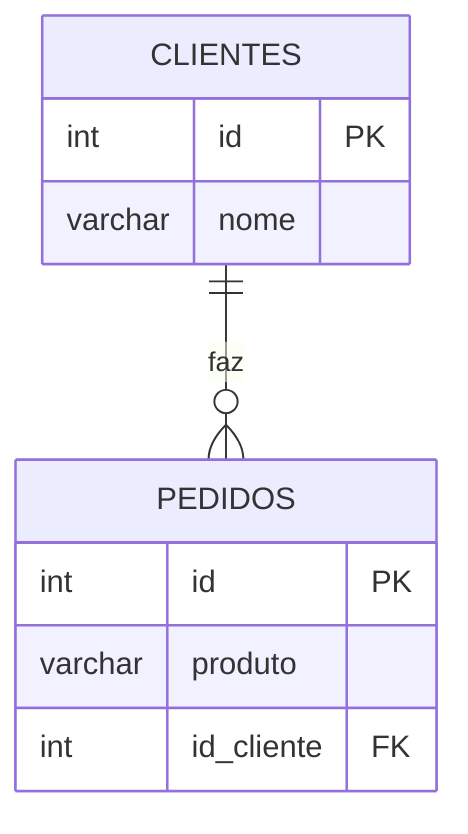

# Aula - Relacionamento de tabelas

## Ideia principal
- **Clientes**: quem compra;
- **Pedidos**: aquilo que foi vendido.
- Cada pedido, guarda o *número do cliente* (id), não o seu nome.
- O **JOIN** junta duas tabelas para mostrar o nome do cliente do lado do seu pedido.

## Diagrama

- `||--o{` -> 1 para muitos (one to many). O cliente poderá ter vários pedidos
- **PK**: O número que identifica cada cliente e cada pedido.
- **FK**: (Chave estrangeira) o número que irá apontar para a outra tabela

## passo a passo 

1- Criamos a tabela:

```sql

CREATE TABLE clientes(
    id SERIAL PRIMARY KEY,
    nome VARCHAR(100)

);

```

2 - Criamos a tabela de pedidos (criando a chave estrangeira):
```sql
CREATE TABLE pedidos(
    id SERIAL PRIMARY KEY,
    produto VARCHAR(100),
    id_cliente INT REFERENCES clientes(id)
);
```

3- inserimos os clientes (daniel nao compra nada na cantina)

```sql
INSERT INTO clientes (nome) VALUES
('Caio'),
('Carla'),
('Daniel')
```

4- Inserimos os produtos para nossos clientes:

```sql 
INSERT INTO pedidos(produto,id_cliente) VALUES
('Pão de queijo',2),
('Café expresso',2),
('Almoço',1)
```

5- Comando INNER JOIN:

```sql
SELECT clientes.nome , pedidos.produto
FROM pedidos
INNER JOIN clientes ON pedidos.id_cliente = clientes.id;
```

- O DANIEL não aparece, pois não possui pedido algum.

6- Utilizando o comando LEFT JOIN
```sql
SELECT clientes.nome,pedidos.produto
FROM clientes
LEFT JOIN pedidos ON clientes.id = pedidos.id_cliente
```
O LEFT: mostra tudo da tabela da esquerda (basicamento, é a tabela após o FROM).