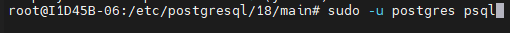
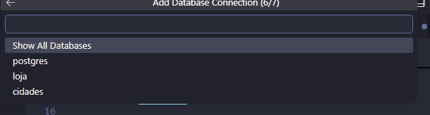
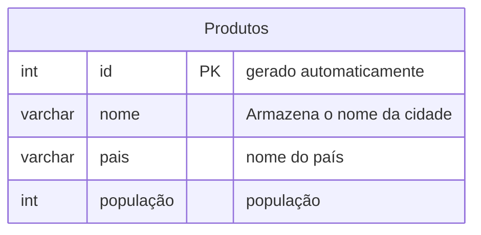
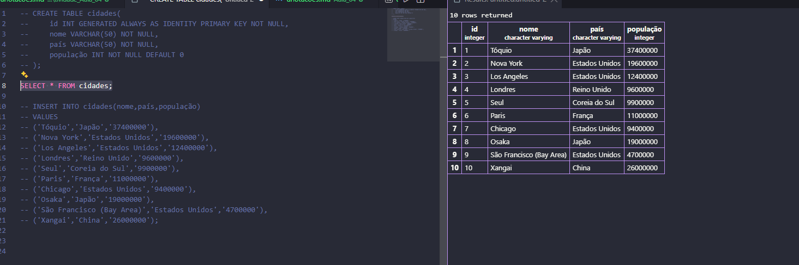

### Atividade Aula 04 
 - Criem um banco de dados chamado: Cidades
 - Criar uma tabela com as 10 cidades mais ricas do mundo
 - Colunas: id, nome da cidade, país, população (escolher o tipo correto de variáveis)
 - Registrar cada etapa do processo, desde a criação do banco até a inserção e consulta de valore

 acessar o seu MOBA e entre com sua senha e depois use o comando:
 ```bash
cd /etc/postgresql/18/main
``` 
>Para poder acessar o posgresql e craiar seu database 

depois usar o comando:



para criar um novo banco de dados, utilizamos o comando:
```sql
CREATE DATABASE cidades;
```
>onde vai aparecer CREATE DATABASE e veja se aparece no sua lista de servidores para confirmar use \l e saia com \q

então  para podemos usar VS para modelação iremos ir onde tem a imagem do elefante e no +  depois colocar o ip onde estara escrito encima do Moba, colcoar postgres.
>atenção não colocar root
sua senha, apertar enter se for sua porta clicar em standar connection



e ir em cidades. apertar enter depois disso.


após isso iremos fazer a modelação do nosso banco de dados:

**Modelando o banco de dados cidade**

>execute o comando usando F5 e depois comente usando o comando ctrl + ;

para consultar todos os dados tabela:
```sql
SELECT * FROM cidades;
```

comando para inserir  informações na tabela :

```sql
SELECT * FROM cidades;

INSERT INTO cidades(nome,população,país)
VALUES('americana','200000','Brasil');
```
>EXEMPLO


pronto!!!



