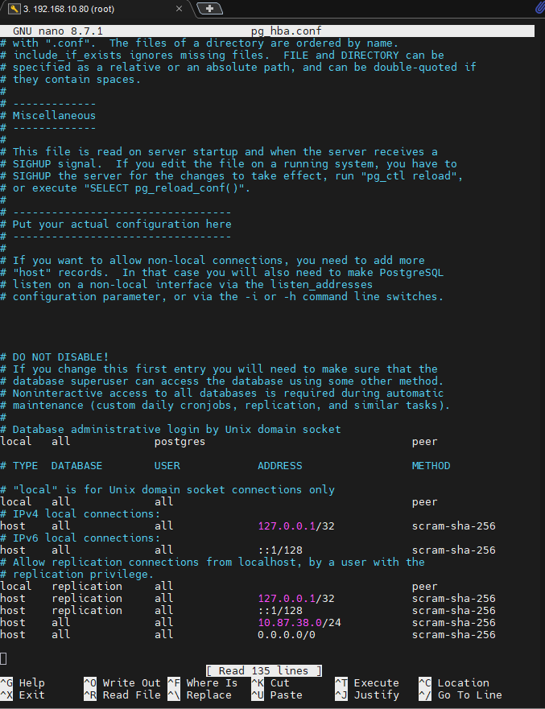
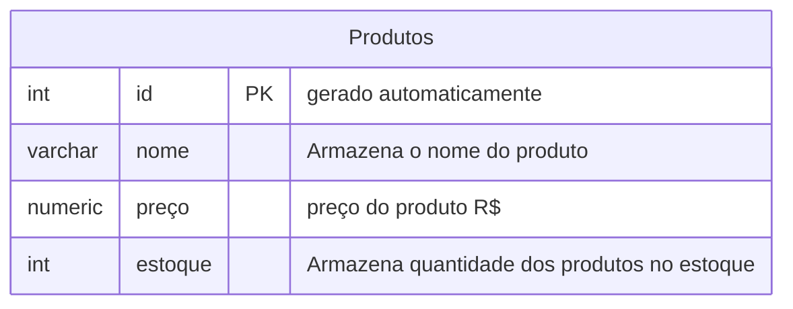

## Aula 04 
alteração de parâmetros dos arquivos de configuração:



---

para excluir um banco de dados, utilizamos o comando:
```sql
DROP DATABASE cidades;
```
>cuidado na operação!
---

para criar um novo banco de dados, utilizamos o comando:
```sql
CREATE DATABASE loja;
```
---
***Modelando o primeiro banco de dados**


Para criação do banco de dados, utilizamos os seguintes comandos:

```sql

REATE TABLE produtos(
    id INT GENERATED ALWAYS AS IDENTITY PRIMARY KEY NOT NULL,
    nome VARCHAR(50) NOT NULL,
    preço NUMERIC(10,2) NOT NULL,
    estoque INT NOT NULL DEFAULT 0
);
```
para consultar todos os dados tabela:
```sql
SELECT * FROM produtos;
```

comando para inserir produtos na tabela:

```sql
SELECT * FROM produtos;

INSERT INTO produtos(nome,preço,estoque)
VALUES('Chuveiro','100','20');
```